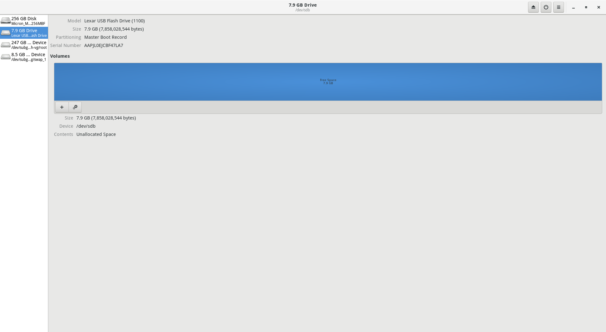
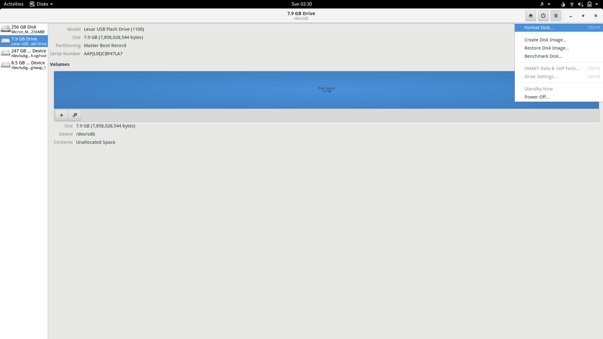
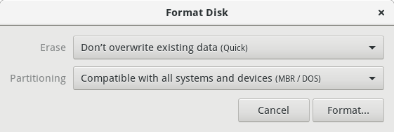
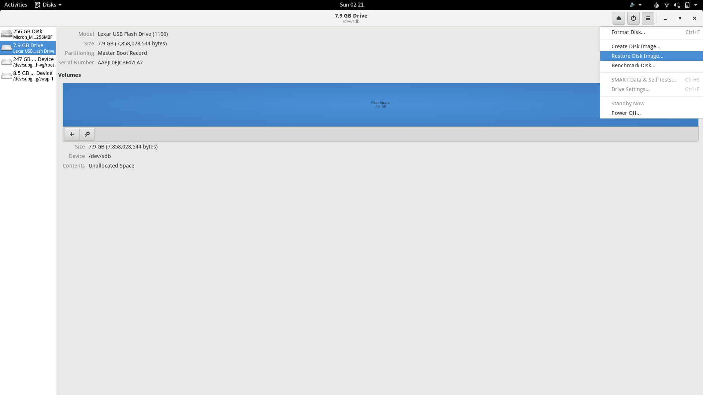
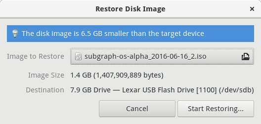

# Installing Subgraph OS

\newpage

## System requirements

Subgraph OS runs on Intel 64-bit computers. These are the system
requirements:

* Intel 64-bit processor (Core2 Duo or later)
* 2GB of RAM (4GB recommended)
* At least 20GB of hard-disk space

\newpage

## Downloading and verifying the Subgraph OS ISO

Subgraph OS can be downloaded from our website:

https://subgraph.com/sgos/download/index.en.html

The Subgraph OS download page always has the most up-to-date download links and
instructions. You can download the ISO directly from the website or over a Tor 
hidden service.

You should always verify that the ISO you downloaded is the official version. 
To verify the ISO, we have included a checksum that is cryptographically signed
by our developers.

> *What is a checksum?*
>
> A checksum (or hash) is a string that uniquely identifies some piece of data
> as being different from another piece of data. It is computed using a special
> hash algorithm (SHA256 in our case). When data is passed to the hash
> algorithm, the algorithm will return a shortened string (the checksum) that
> uniquely identifies the data. Checksums are often used to ensure the `integrity`
> of a file. `Integrity` in this case means that the file has not been corrupted
> or tampered with during the download.
>
> *What is a cryptographic signature?*
>
> A cryptographic (or digital) signature is a method of authenticating a piece
> of data. Data is signed with the `private` signing key of a person who has
> created or is sending the data. The signature can then be verified by the
> recipient using the `public` key of the sender. If the verification is
> successful, this ensures that the data was created or sent by the person who
> signed it and not somebody else. This `authenticates` the identify of the
> creator or sender. 
>
> *Why do we cryptographically sign the checksum?*
>
> The checksum is used to verify the `integrity` the ISO you have downloaded. 
> However, how do you verify that the checksum on our website was provided by
> us? By cryptographically signing the checksum with our `private` key, you can
> verify the `authenticity` of the checksum.

### Verifying the ISO on a Linux computer

To verify the ISO on a Linux computer, you will need to download the ISO, SHA256
checksum, and the signature for the checksum.

The first step is to download our public key, Our public key can be downloaded
with the following command:

```
$ gpg --recv-key B55E70A95AC79474504C30D0DA11364B4760E444
```

The second step is to verify the `authenticity` of the signature for the
checksum. Run the following command to verify the signature (note: replace the
filenames with the names of the files you downloaded):

```
$ gpg --verify subgraph-os-alpha_2016-06-16_2.iso.sha256.sig subgraph-os-alpha_2016-06-16_2.iso.sha256
```

After running this command, you should see a `Good Signature` message. If you
have seen this message then you can proceed to the next step.

The third step is to verify the `integrity` of the ISO using the SHA256 checksum. 
Run the following command to verify the checksum (note: replace the filenames with the
names of the files you downloaded):

```
$ sha256sum -c subgraph-os-alpha_2016-06-16_2.iso.sha256
```

After running the command, you should see:

```
subgraph-os-alpha_2016-06-16_2.iso: OK
```

Congratulations, you have now downloaded and verified the Subgraph OS ISO. You
are now ready to try it out!

\newpage

## Installing from a USB drive on a Linux computer

This section describes how to create a USB installer using Linux. One of these
methods will work on any Linux computer (even on Subgraph OS). To create an
installer you will need a USB drive with a capacity a 2GB or more.

### Creating a USB installer using Gnome Disks

If you have a Linux computer that is running the Gnome Desktop, you can use the 
**Gnome Disks** application to create a USB installer.

The following steps show how to make a USB installer using **Gnome Disks**:

1. Insert a USB drive into your Linux computer

2. Open the **Gnome Disks** application

3. Select your USB drive



\newpage 

4. Select the **Format Disk** option in the top right corner of **Gnome Disks**



\newpage 

5. *Format* the USB drive



\newpage 

6. Select the **Restore Disk Image** option in the top right corner of **Gnome
   Disks**



\newpage

7. Choose the ISO file you want to *restore* (copy) to the USB drive

8. *Restore* the ISO to the USB drive



\newpage

It should take a few minutes to copy the ISO to the USB drive. 

\newpage

### Creating a USB installer using dd

If your Linux computer is not running Gnome Desktop or you want to create the
installer from the command-line, you can use the **dd** utility.

The following steps show how to make a USB installer using **dd**:

1. Insert a USB drive into your computer

2. Open a terminal and run the following command to identify the name of the USB
   drive: 
```{bash}
$ lsblk
```
    **NOTE**: You should see a name such as **/dev/sdx** for your drive, for
    example: **/dev/sdb**. It is important to use only the name without the 
    partition number. If you see something like **/dev/sdb1**, you can omit 
    the **1** at the end. The **dd** command uses the name without the partition 
    number.

3. In the same terminal, run the following command:
```{bash}
$ dd bs=4M if=subgraph-os-alpha_2016-06-16_2.iso of=/dev/sdx status=progress && sync
```
   **NOTE**: Replace the path of the ISO with the path of the ISO you have
   downloaded and verified. Replace **/dev/sdx** with the name of your USB
   drive, for example: **/dev/sdb**.

Copying the ISO to the USB drive should take a few minutes.

\newpage

## Booting from a USB drive (Live mode)

Subgraph OS also features a 'live' mode. Subgraph OS live mode runs in memory, 
directly from the USB drive. While running in live mode, nothing
will be saved to your hard-drive. When the live session ends, any data created
during your session will disappear, leaving no traces behind on the hard-disk. 
\
\
People normally run in live mode for the following reasons:

1. They want to demo Subgraph OS
2. They want to test Subgraph OS with their particular hardware
3. They want to perform certain tasks with extra security and privacy but
do not want a permanent installation of Subgraph OS

\newpage

When the Subgraph OS ISO starts, you will be presented with different options.
To start the live mode, select `Live (amd64)`.


Please note that the user password on the live image is: *live*.

\newpage

